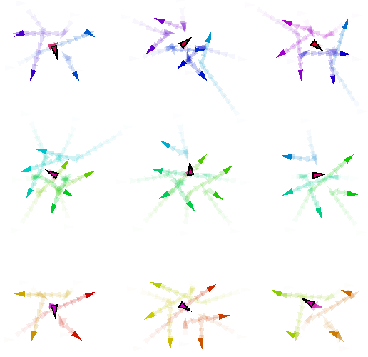

## Requirements
For running the examples, the simulations and the chart generation, you need to have the following installed:

- A valid JDK installation (>= 11)
- A python installation (>= 3.8)

## Running the examples
The examples are located in the [src/main/scala/it/unibo/scafi/example](https://github.com/AggregateComputing/experiment-2023-coordination-swarm-behaviour/tree/main/src/main/scala/it/unibo/scafi/examples) folder.
Each example has an associated yaml file, which contains the configuration for the Alchemist simulation.
In the following we briefly describe how to run each example and what it is the expected result.

For enabling the trace, follow the following video:
<p align="center">

</p>


<details>
  <summary class="summary-title">Constant movement</summary>
    <table class="center-table">
        <tr>
            <td>Example</td>
            <td>Description</td>
            <td>Command</td>
        </tr>
        <tr>
                <td> <a href="https://github.com/AggregateComputing/experiment-2023-coordination-swarm-behaviour/tree/main/src/main/scala/it/unibo/scafi/examples/ConstantMovement.scala"> src/main/scala/it/unibo/scafi/examples/ConstantMovement.scala </a> </td>
            <td>A swarm of agents moving in a straight line</td>
            <td>./gradlew runConstantMovementGraphic</td>
        </tr>
    </table>
    <p align="center">
        
    </p>
</details>

<details>
  <summary class="summary-title">Explore</summary>
    <table class="center-table">
        <tr>
            <td>Example</td>
            <td>Description</td>
            <td>Command</td>
        </tr>
        <tr>
            <td><a href="https://github.com/AggregateComputing/experiment-2023-coordination-swarm-behaviour/tree/main/src/main/scala/it/unibo/scafi/examples/Explore.scala">src/main/scala/it/unibo/scafi/examples/Explore.scala</a></td>
            <td>A swarm of agents exploring a fixed area</td>
            <td>./gradlew runConstantMovementGraphic</td>
        </tr>
    </table>
    <p align="center">
        
    </p>
</details>

<details>
  <summary class="summary-title">Obstacle Avoidance</summary>
    <table class="center-table">
        <tr>
            <td>Example</td>
            <td>Description</td>
            <td>Command</td>
        </tr>
        <tr>
            <td><a href="https://github.com/AggregateComputing/experiment-2023-coordination-swarm-behaviour/tree/main/src/main/scala/it/unibo/scafi/examples/ObstacleAvoidance.scala">src/main/scala/it/unibo/scafi/examples/ObstacleAvoidance.scala</a></td>
            <td>A swarm that try to avoid obstacles</td>
            <td>./gradlew runObstacleAvoidanceBigGraphic or ./gradlew runObstacleAvoidanceMiddleGraphic or ./gradlew runObstacleAvoidanceGraphic</td>
        </tr>
    </table>
    <p align="center">
        
    </p>
</details>

<details>
  <summary class="summary-title">Towards Leader</summary>
    <table class="center-table">
        <tr>
            <td>Example</td>
            <td>Description</td>
            <td>Command</td>
        </tr>
        <tr>
            <td><a href="https://github.com/AggregateComputing/experiment-2023-coordination-swarm-behaviour/tree/main/src/main/scala/it/unibo/scafi/examples/TowardsLeader.scala">src/main/scala/it/unibo/scafi/examples/TowardsLeader.scala</a></td>
            <td>Nodes go towards a sink point (a leader)</td>
            <td>./gradlew runTowardsLeaderGraphic</td>
        </tr>
    </table>
    <p align="center">
        
    </p>
</details>

<details>
  <summary class="summary-title">Spin Around a Leader</summary>
    <table class="center-table">
        <tr>
            <td>Example</td>
            <td>Description</td>
            <td>Command</td>
        </tr>
        <tr>
            <td><a href="https://github.com/AggregateComputing/experiment-2023-coordination-swarm-behaviour/tree/main/src/main/scala/it/unibo/scafi/examples/BranchingExample.scala">src/main/scala/it/unibo/scafi/examples/BranchingExample.scala</a></td>
            <td>Nodes spin aroud a leader</td>
            <td>./gradlew runSpinAroundGraphic</td>
        </tr>
    </table>
    <p align="center">
        
    </p>
</details>

<details>
  <summary class="summary-title">Reynolds Flocking</summary>
    <table class="center-table">
        <tr>
            <td>Example</td>
            <td>Description</td>
            <td>Command</td>
        </tr>
        <tr>
            <td><a href="https://github.com/AggregateComputing/experiment-2023-coordination-swarm-behaviour/tree/main/src/main/scala/it/unibo/scafi/examples/ReynoldFlock.scala">src/main/scala/it/unibo/scafi/scala/examples/ReynoldFlock.scala</a></td>
            <td>Swarm moving following reynolds rule</td>
            <td>./gradlew runReynoldFlockGraphic</td>
        </tr>
    </table>
    <p align="center">
        
    </p>
</details>

<details>
  <summary class="summary-title">Team Formation (branching)</summary>
    <table class="center-table">
        <tr>
            <td>Example</td>
            <td>Description</td>
            <td>Command</td>
        </tr>
        <tr>
            <td><a href="https://github.com/AggregateComputing/experiment-2023-coordination-swarm-behaviour/tree/main/src/main/scala/it/unibo/scafi/examples/BranchingExample.scala">src/main/scala/it/unibo/scafi/scala/examples/BranchingExample.scala</a></td>
            <td>Example of team formation through branch</td>
            <td>`./gradlew runBranchingExampleGraphic`</td>
        </tr>
    </table>
    <p align="center">
        
    </p>
</details>

<details>
  <summary class="summary-title">Team Formation (logical)</summary>
    <table class="center-table">
        <tr>
            <td>Example</td>
            <td>Description</td>
            <td>Command</td>
        </tr>
        <tr>
            <td><a href="https://github.com/AggregateComputing/experiment-2023-coordination-swarm-behaviour/tree/main/src/main/scala/it/unibo/scafi/examples/TeamFormation.scala">src/main/scala/it/unibo/scafi/scala/examples/TeamFormation.scala</a></td>
            <td>A swarm that create several sub-swarm based on spatial constraints</td>
            <td>./gradlew runTeamFormationGraphic</td>
        </tr>
    </table>
    <p align="center">
        
    </p>
</details>

<details>
  <summary class="summary-title">Shape Formation</summary>
    <table class="center-table">
        <tr>
            <td>Example</td>
            <td>Description</td>
            <td>Command</td>
        </tr>
        <tr>
            <td><a href="https://github.com/AggregateComputing/experiment-2023-coordination-swarm-behaviour/tree/main/src/main/scala/it/unibo/scafi/examples/AllShape.scala">src/main/scala/it/unibo/scafi/scala/examples/AllShape</a></td>
            <td>A swarm of nodes that form several shapes</td>
            <td>./gradlew runAllShapeGraphic</td>
        </tr>
    </table>
    <p align="center">
        
    </p>
</details>

For other examples, please refer to the [examples](https://github.com/AggregateComputing/experiment-2023-coordination-swarm-behaviour/tree/main/src/main/yaml) folder. For each file, you can run the corresponding example with the following command:

```bash
./gradlew run<ExampleName>Graphic
```

### Simulation: Find and Rescue
The focus is on a scenario involving a fleet of drones patrolling a 1 km² area, 
designed to respond to emergency situations such as fires or injuries. 
In the following, we describe the main characteristics of the scenario, 
the simulation parameters, and the expected results.

#### Scenario Details

- **Environment**: A spatial area of 1 km².
- **Emergency Situations**: These include events like fires or injuries, and are randomly generated within the simulation.
- **Drone Fleet Composition**:
    - **Explorers**: 50 drones tasked with identifying emergency situations.
    - **Healers**: 5 drones designated to respond to and resolve emergencies.
- **Operation**: Exploration is conducted in groups, each consisting of at least one healer and multiple explorers.
- **Drone Specifications**:
    - **Speed**: Maximum of 20 km/h.
    - **Communication Range**: 100 meters.
- **Simulation Parameters**:
    - **Duration**: Each run lasts 90 minutes.
    - **Emergency Generation**: Emergencies occur randomly in a [0, 50] minutes timeframe.
    - **Objective**: Minimize the number of unresolved emergency situations.

#### Running the Simulation

To observe the dynamics of the simulation, execute the following command:

```bash
./gradlew runRescueGraphic
````

In the following there is a sequence of screenshots of the simulation:

<div class="centering">
  
  
  
</div>

#### Further Information

For a comprehensive understanding and additional details, please refer to the [accompanying academic paper](https://link.springer.com/chapter/10.1007/978-3-031-35361-1_2).


#### Reproduce the results
To reproduce the results of the paper, you can run the following command:

```bash
./gradlew runRescueBatch
```
This will launch 64 simulations with different seeds. Each of them, will produce a csv file in the `data` folder.
In this repository, the data is already loaded,
so you can directly run the following command to generate the plots:
```bash
pip install -r requirements.txt
python process.py
```
This will produce the following charts stored in charts/:


<div class="centering">
  
  
  
</div> 