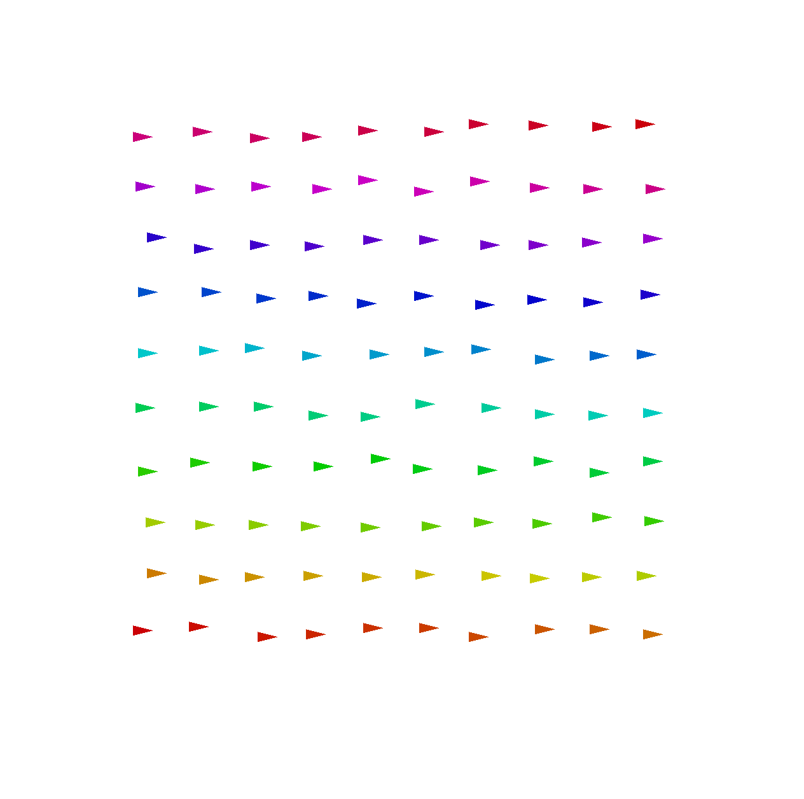
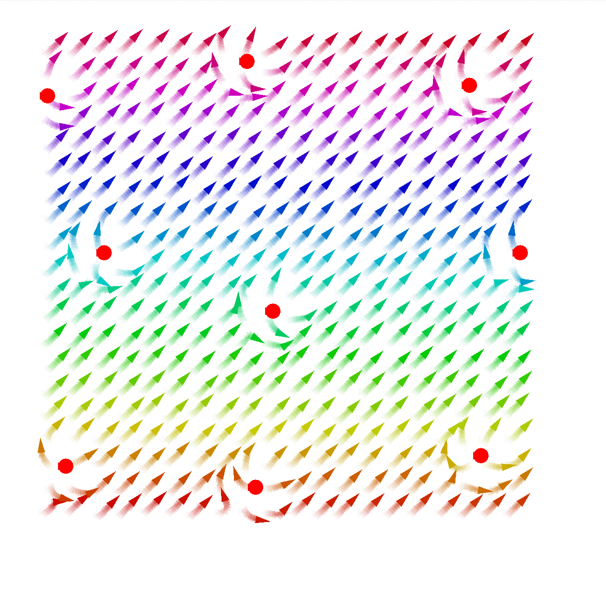
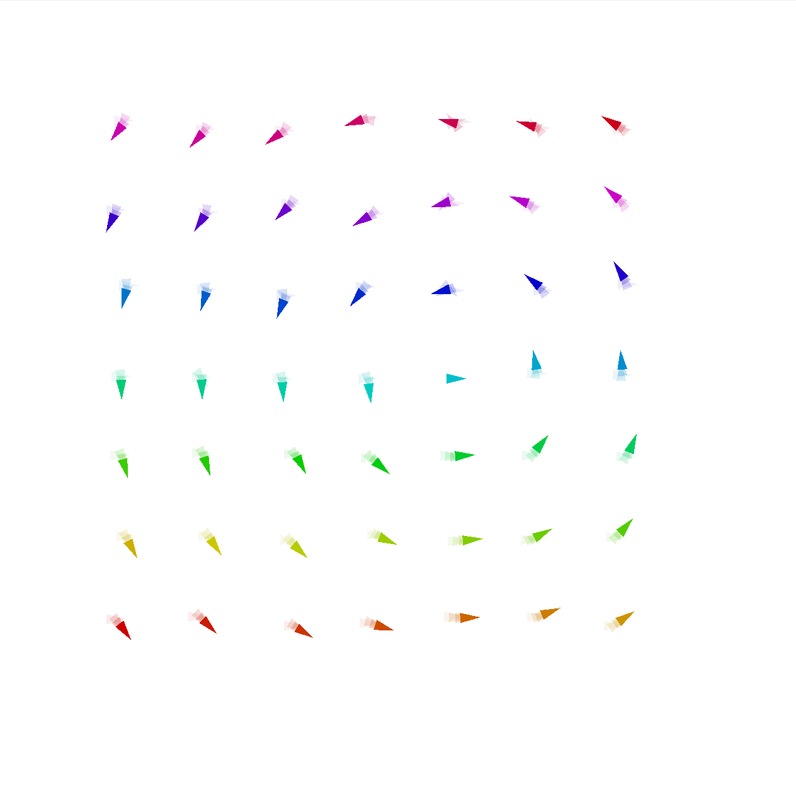
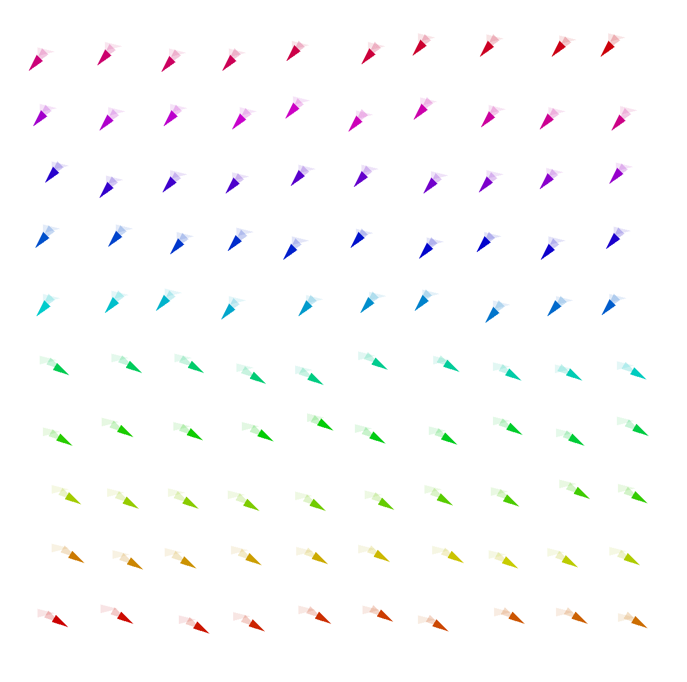
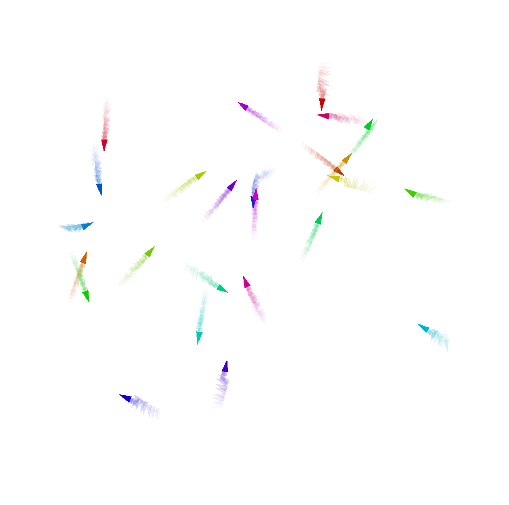
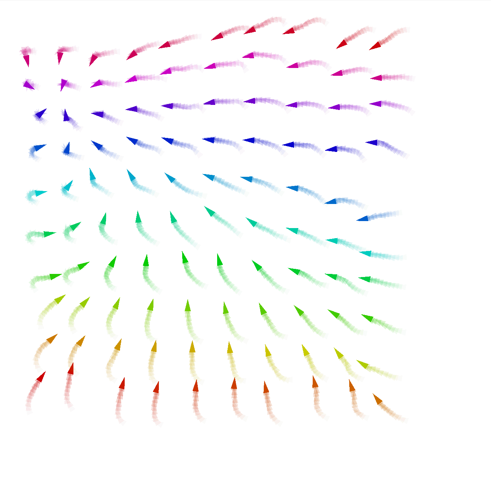
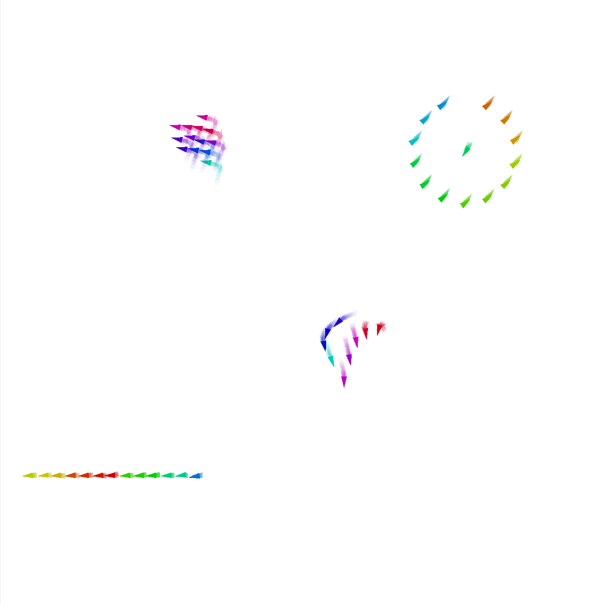
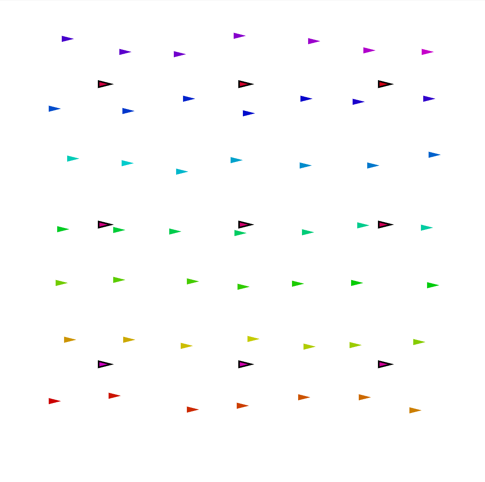

Macro Swarm is a field-based libraries for expressing swarm behaviors in a declarative way.
It is built on top of the Aggregate computing framework, which is a distributed computing framework for the JVM.
Particularly, it is built of top of [ScaFi](https://scafi.github.io/), a scala library for programming aggregate computing systems. 
